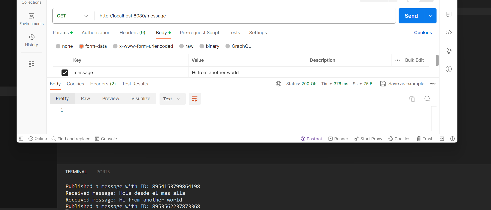

# Dilmun

This is a simple project related with pubsub + go 

## How to run

### Requirements

- Go 1.21 or higher

### Environment variables

See the [`.env.example`](.env.example) file to see the environment variables that you need to set.

### Run

```bash
go run main.go
```

Example of calling the endpoint:

```bash
curl --location --request POST 'http://localhost:8080/message' \
--form 'message=Hello world'
```

## Result of the project

